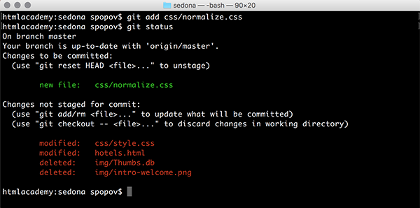

[***К содержанию***](readme.md)

### ***GIT ADD***
***

Чтобы добавить отслеживание новых файлов, необходимо использовать команду

`git add` *filename* *filename*  // для добавления нескольких файлов по имени.

В случае если у вас много файлов для добавления, можно воспользоваться командой `git add .`, которая добавляет отслеживание для всех новых файлов из текущей директории. 

А команда `git add -A` добавляет ещё и удалённые файлы, не только из текущей директории, но и из всего локального репозитория.

