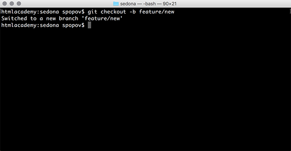
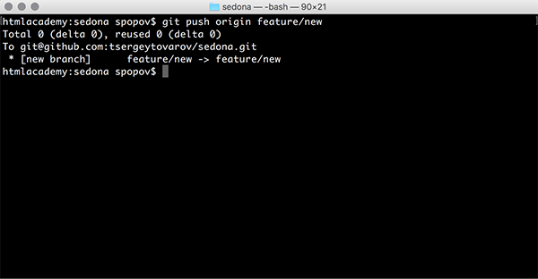
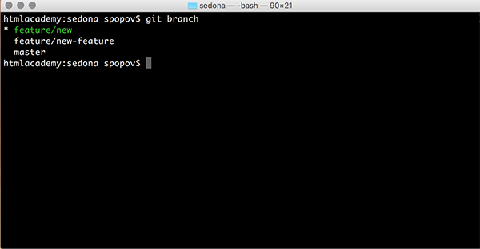
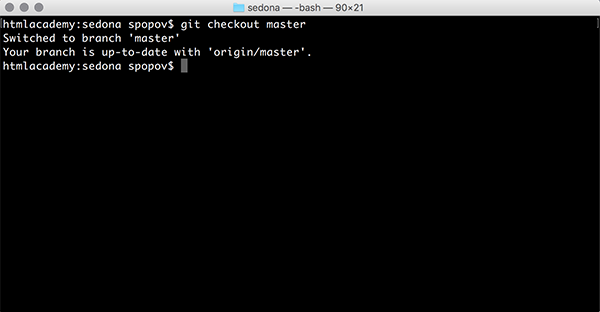

### ***РАБОТА С ВЕТКАМИ***
Работая с Git, приходится постоянно создавать и перемещаться по веткам.

***

Команда `git checkout -b` *branch-name* создаст ветку с указанным именем и автоматически переключится на неё.

---

После создания ветку можно отправить на сервер с помощью команды `git push origin` *branch-name*.

---

Чтобы не хранить названия веток в памяти или не искать названия веток, существуют две специальные команды, которые позволяют посмотреть все существующие ветки локального репозитория `git branch` или все существующие ветки удалённого репозитория `git branch -r`.

---

Переключиться на любую локальную ветку можно с помощью команды `git checkout` *branch-name*.

