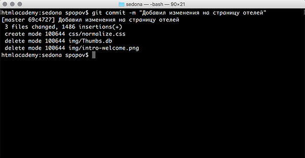

[***К содержанию***](readme.md)

### ***GIT COMMIT -M***

***

После того как добавлены все новые и удалены старые файлы, можно делать фиксацию изменений. 

Фиксация изменений или коммит, очень важна, так как до выполнения этой команды ваши локальные изменения никуда не запишутся. 

Чтобы добавить коммит, необходимо ввести команду `git commit -m` `"`*Комментарий к коммиту*`"`.

