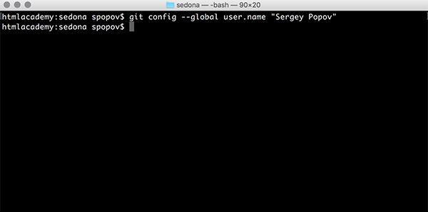
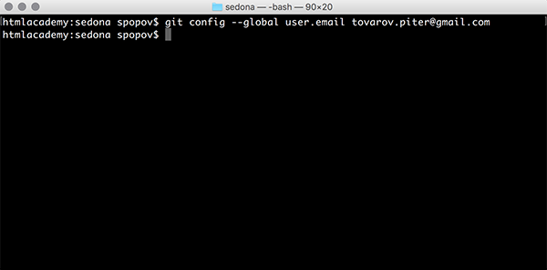
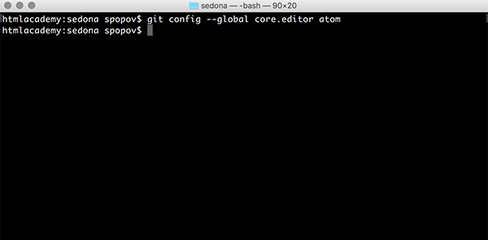
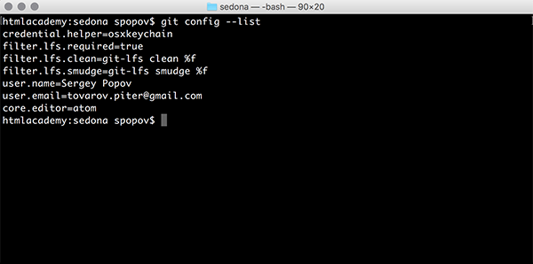

### ***ПЕРВОНАЧАЛЬНАЯ НАСТРОЙКА GIT***
***
**Установка имени пользователя, от которого будут идти коммиты.**

`git config --global user.name` `"`*User Name*`"`

---

**Установка адреса электронной почты.** 

`git config --global user.email` *email*

Обратите внимание, что адрес должен совпадать с тем, на который зарегистрирован аккаунт в Гитхабе.

---

**Установка текстового редактора, в котором будут открываться файлы для решения конфликтов.**

`git config --global core.editor` *editor*

---

**Посмотреть список всех установленных настроек.**

`git config --list`

