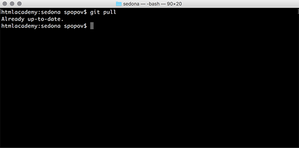

### ***GIT PULL***

***

Любая работа с изменениями начинается с получения последней версии удалённого репозитория. Получить последнюю версию можно с помощью команды `git pull`. 

Будьте внимательны, вызов этой команды сотрёт все незафиксированные изменения.

