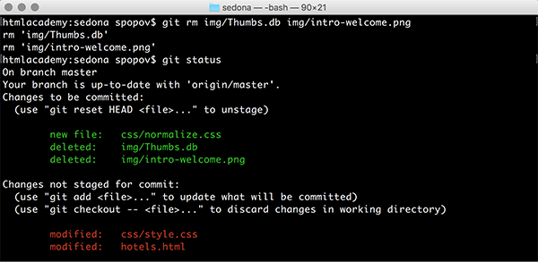

[***К содержанию***](readme.md)

### ***GIT RM***

***

Помимо добавления файлов, их также необходимо удалять. 

Для этого существует команда `git rm` *filename* *filename*, которая удаляет файлы по их имени.

