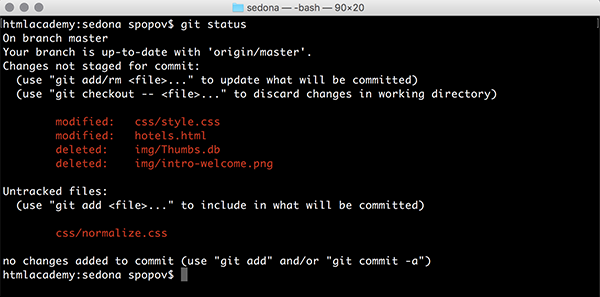

### ***GIT STATUS***

***

После внесения изменений в проект можно посмотреть статус файлов с помощью команды `git status`. 

Она покажет файлы, в которых были произведены изменения, удалённые и новые, требующие добавления.

